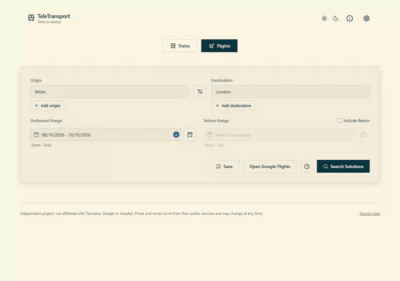

# TeleTransport

Search trains and flights across several days and rank them by what the trip really costs you.

[](https://github.com/luca-battaglia/TeleTransport/actions/workflows/ci.yml)
[](LICENSE)

**Try it:** [teletransport.vercel.app](https://teletransport.vercel.app)



I built this because I kept doing the same sums by hand. Is a €30 flight at 5:40, with an hour's drive to the airport, better than a €55 train after breakfast? TeleTransport searches Trenitalia and Google Flights over the dates you give it, puts a price in euros on travel time, early starts, late arrivals, changes and airport transfers, and sorts every option by the total. I call that the adjusted cost.

- Trains from Trenitalia, flights from Google Flights through [SerpApi](https://serpapi.com)
- Up to 5 origins and 5 destinations, and up to 14 days each way, even non-consecutive ones
- Cities with more than one airport are searched on all of them: Milan means Malpensa, Linate and Bergamo
- You decide what an hour of your time is worth, in the settings or in [`travel_ranker.toml`](travel_ranker.toml)
- Each result opens the operator's own page for that route and day, ready to book
- A web app in English and Italian, and a command-line version with the same options

Flight searches need a free SerpApi key, which you paste in the settings. Without one, the live site lets you try a couple of small flight searches a day.

## How the ranking works

```text
adjusted_cost = price
              + duration_hours × time_value_eur_per_hour
              + hours before early_departure_ref_hour × early_departure_penalty_eur_per_hour
              + hours after late_arrival_start_hour × late_arrival_penalty_eur_per_hour
              + changes × change_penalty_eur
              + airport transfers (flights only: fuel, plus driving hours at your and your companions' time value)
```

Ties go to the shorter trip. A round-trip flight is priced as a whole, with the penalties of both legs.

## How it's built

```text
 Browser ──► Next.js (Vercel) ──/api proxy──► Caddy (TLS) ──► FastAPI (ARM VM)
                                                                 │
 CLI ───────────────────────────────────────────────────► core/search.py
                                                                 │
                                          ┌──────────────────────┴──────────────────────┐
                                   core/trains.py                                core/flights.py
                               LeFrecce JSON endpoints                       SerpApi Google Flights
                             (headless browser context)
```

The API (FastAPI) and the CLI call the same code in [`core/`](core), so they always rank the same way. Trenitalia has no public API, so the backend calls the same JSON endpoints its website uses, through a headless Chromium that holds the site's cookies. The browser only starts when the cache misses: responses are cached in SQLite, so a repeated search is free. The backend runs on an ARM virtual machine behind Caddy, and the Next.js frontend on Vercel forwards `/api` to it.

| Folder | What's in it |
|---|---|
| [`core/`](core) | The search engine: Trenitalia and SerpApi clients, scoring, cache |
| [`backend/`](backend) | FastAPI app: input validation, rate limits, the demo quota |
| [`cli/`](cli) | Command-line version |
| [`frontend/`](frontend) | Next.js web app |
| [`tests/`](tests) | pytest suite, with Trenitalia and SerpApi mocked |

## Running it locally

You need Python 3.11+ and Node.js 20.9+. Trains work straight away, flights need a [SerpApi key](https://serpapi.com/users/sign_up).

```bash
python -m venv .venv
source .venv/bin/activate          # Windows: .venv\Scripts\activate
pip install -r requirements.txt
playwright install chromium
cp .env.example .env               # add SERPAPI_KEY for the CLI

uvicorn backend.main:app --port 8000
```

In a second terminal:

```bash
cd frontend
npm install
npm run dev                        # http://localhost:3000
```

Put your SerpApi key in the settings of the web app. The API docs are at http://127.0.0.1:8000/docs, and the server options (rate limits, demo quota, the secret the frontend and the API share in production) are listed in [`.env.example`](.env.example).

## Command line

```bash
python -m cli trains --from "Milano Centrale" --to "Roma Termini" --dep 3-5/10 --ret 10/10
python -m cli flights --from Zurich --to Rome --to Naples --dep 2026-10-03 --sort day --links
```

```text
| Route                           | Departure        | Arrival          | Duration   |   Changes |   Price (EUR) |   Adj. cost (EUR) |
|---------------------------------|------------------|------------------|------------|-----------|---------------|-------------------|
| Milano Centrale -> Roma Termini | 2026-10-02 19:35 | 2026-10-02 22:39 | 3h04       |         0 |         50.90 |            121.98 |
| Milano Centrale -> Roma Termini | 2026-10-02 17:35 | 2026-10-02 20:45 | 3h10       |         0 |         62.90 |            126.23 |
```

Dates can be `2026-10-03`, `3/10`, `3-5/10` or `30/9..2/10`, and `--dep` and `--ret` can be repeated. Station names are in Italian, because that is what Trenitalia understands. `python -m cli trains --help` lists every option.

## Tests

```bash
pip install -r requirements-dev.txt
pytest
ruff check .
cd frontend && npm run lint && npm run build
```

GitHub Actions runs them on every push, and the backend is only deployed when they pass.

## Privacy

Your SerpApi key stays in your browser and reaches the server only with your flight searches. The server does not store or log it. Rate limits count searches per visitor through hashed IP addresses that expire within two days.

## Good to know

- Trenitalia's endpoints are not documented, so they can change without warning.
- Trenitalia keeps you logged in per browser tab, so a booking link opens logged out unless a Trenitalia tab is already open. [`userscripts/`](userscripts) has an optional Tampermonkey script that fixes it.
- TeleTransport is not affiliated with Trenitalia, Google or SerpApi. It reads public timetables and fares at low volume, with caching, and does not book or resell anything. The prices on the operators' sites are the ones that count.

## License

[AGPL-3.0-or-later](LICENSE). You can use, change and host it. If you run a modified version as a service, you have to offer its source to the people using it.
